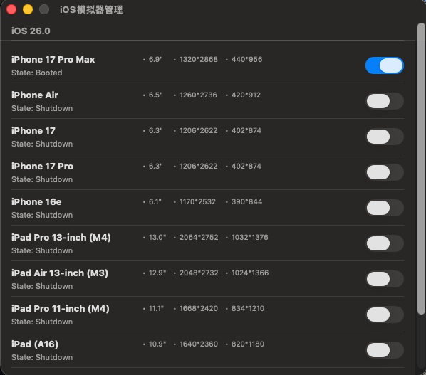

## iOS 模拟器管理

方便控制 Mac 上安装的 iOS 模拟器

## 使用

### 最新版本 [📥 下载](https://github.com/ke112/iOSSimulatorManager/raw/refs/heads/main/assets/newVersion/iOS模拟器管理.zip)

### 如果点击下载不好用, 可前往百度云下载 [百度云下载](https://pan.baidu.com/s/18YqR07A5fJNtgyqj_hmZHg?pwd=6688)

### 将下载的.zip 解压得到.app, 放到应用程序中

如果出现"无法打开 xxx 弹窗", 请执行以下命令后就可以打开.app

`sudo xattr -r -d com.apple.quarantine /Applications/iOS模拟器管理.app`

## 贡献

如果觉得对你有帮助，欢迎 star。

这个项目会持续更新。如果你有新的想法，欢迎提交 issues 或 pull requests 到 [GitHub Repository](https://github.com/ke112/iOSSimulatorManager/)，空闲时我会添加新功能。

## 联系

作者 : 徐凤年

微信 : zhang1102d

脸书 : https://www.facebook.com/zhihua.zhang.3958

## 更新日志

| 日期       | 版本   | 更新内容                                            |
| ---------- | ------ | --------------------------------------------------- |
| 2025-09-22 | v0.0.3 | 兼容 iOS 26 iOS Simulator                           |
| 2025-06-24 | v0.0.2 | 添加菊花 loading 状态，无数据时的兜底状态，刷新功能 |
| 2025-01-11 | v0.0.1 | 首次提交 iOS 模拟器管理。                           |
